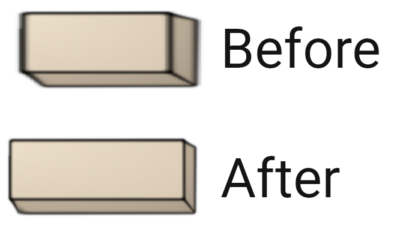

# Introduction
The whole purpose of putting together this web page is so that I can write about and share some of the things I've been working on. What I learnt while putting this together is that it's shockingly difficult to get nice high quality screenshots straight out of Unity. I'm always either hitting pause a frame too late, the camera isn't positioned exactly where I want it, or it may just be a shot that I can't actually achieve with the range of the camera as I've implemented it.

So, instead of actually working on more core mechanics, enemies, or levels, or just about anything that will bring the game closer to a meaningful degree of progress... I'm implementing a camera mode! I know, I know, sometimes my genius is almost freightening.

# The Plan

The original plan, before it grew out of control and I ended up digging myself into a two month rabbit hole was to have the ability to just hit a button, and be able to go into a second detached free camera. You'd basically be able to:

- Move up, down, forward, backward.
- Pan using the mouse or right joystick.
- Take screenshots with the press of a button.

Sounds simple right?

# The Free Cam

The first thing I did was to put together the camera controls itself. This was straightforward, I just made a new control mapping and wired it into controlling the position of a cinemachine camera.

<iframe 
class="aspect-video w-full my-5"
width="560" 
height="315" 
src="https://www.youtube.com/embed/F8qqBBvlXK8" 
title="Free Cam Demo" 
frameborder="0"
allow="accelerometer; autoplay; clipboard-write; encrypted-media; gyroscope; picture-in-picture; web-share" 
referrerpolicy="strict-origin-when-cross-origin" 
allowfullscreen>
</iframe>

Now the text things was where it became more complicated... Switching during runtime between the main camera and this free camera. I ended up implementing every game developers favourite solutions... a Singleton! If you're unaware singleton classes are a special kind of class in object oriented programming which will only have a single instance, I hear game developers try to avoid these, I don't know why and I have no doubt I'll learn the hard way in the next few months but regardless! 

The singleton I implemented is essentially a queue storing the currently used camera, so initially it will just have the main camera and when the player switches to the free cam it will put the free cam into the queue and use the top as priority. Then when done with the camera, just remove it from the queue and the main camera will be the top again. I also implemented a similar structure for managing the currently active control scheme. With that, I now had switching active cameras implemented.

<iframe 
class="aspect-video w-full my-5"
width="560" 
height="315" 
src="https://www.youtube.com/embed/ihRo3hp3qr4" 
title="Free Cam Switching Demo" 
frameborder="0"
allow="accelerometer; autoplay; clipboard-write; encrypted-media; gyroscope; picture-in-picture; web-share" 
referrerpolicy="strict-origin-when-cross-origin" 
allowfullscreen>
</iframe>

# Control Hints

And this is where the scope creep started to hit. 

I found I kept forgetting what buttons I'd mapped to the camera controls "uhh was down shift or c?" I managed to mix up just about every time. Consequently I thought this might be a good oppurtunity to implement a reuable UI system for displaying control hints. Now there's a couple of things you should know about me. For one, I suck at UI design, and for another I'm a bit of a perfectionist. Trust me, that is not an ideal combination.

The first thing I did here was put together a plain key icon, with the idea being I can just scale the width and throw some text on top for whatever key is mapped to that control, with some hint text beside it. This ended up being a wee bit chunkier than I'd anticipated so I sliced the sprite into three sections, the left, middle, and right so that I could get away with only stretching the middle section, so it would be a bit less noticable that I'm stretching this poor icon out.



Now this is all well and good, I was fairly pleased with the outcome here. What came next was that the game is meant to be playable with a controller, in fact that's the preferred control device, so I wanted to also have controller icons. This was a bit of a rabbit hole in that on a PC game a user could be using any number of controllers. They could be using a Playstation controller, an Xbox controller, a Steam controller, a Switch controller, hell for all I know they might be rocking an Ouya controller. I decided to just focus on the main flagships, Playstation, Xbox (and Steam because they're basically the same), and Switch. 

Because controls can be remapped I put together a full set of sprites for each controller button for each of those controllers, which being terrible at graphic design took me a solid weeks worth of revising until I got something that was just good enough. In order to get these into the Unity side of things I ended up putting together an absolute mess of a class of hardcoding mappings of button ids to each of the different control sprites. 

```
public class ControllerIconStore : ScriptableObject
{
    // Face butttons
    [SerializeField] private ControllerIconDefinition northIcon;
    public ControllerIconDefinition NorthIcon { get { return northIcon; } }
    
    [SerializeField] private ControllerIconDefinition eastIcon;
    public ControllerIconDefinition EastIcon { get { return eastIcon; } }
    
    [SerializeField] private ControllerIconDefinition southIcon;
    public ControllerIconDefinition SouthIcon { get { return southIcon; } }
    
    [SerializeField] private ControllerIconDefinition westIcon;
    public ControllerIconDefinition WestIcon { get { return westIcon; } }


    // Dpad
    [SerializeField] private ControllerIconDefinition dpadUpIcon;
    public ControllerIconDefinition DpadUpIcon { get { return dpadUpIcon; } }
    
    [SerializeField] private ControllerIconDefinition dpadRightIcon;
    public ControllerIconDefinition DpadRightIcon { get { return dpadRightIcon; } }
    
    [SerializeField] private ControllerIconDefinition dpadDownIcon;
    public ControllerIconDefinition DpadDownIcon { get { return dpadDownIcon; } }

    [SerializeField] private ControllerIconDefinition dpadLeftIcon;
    public ControllerIconDefinition DpadLeftIcon { get { return dpadLeftIcon; } }


    // Options / Share
    [SerializeField] private ControllerIconDefinition shareIcon;
    public ControllerIconDefinition ShareIcon { get { return shareIcon; } }

    [SerializeField] private ControllerIconDefinition optionsIcon;
    public ControllerIconDefinition OptionsIcon { get { return optionsIcon; } }


    // Bumpers
    [SerializeField] private ControllerIconDefinition lBumperIcon;
    public ControllerIconDefinition LBumperIcon { get { return lBumperIcon; } }

    [SerializeField] private ControllerIconDefinition rBumperIcon;
    public ControllerIconDefinition RBumperIcon { get { return rBumperIcon; } }


    // Triggers
    [SerializeField] private ControllerIconDefinition lTriggerIcon;
    public ControllerIconDefinition LTriggerIcon { get { return lTriggerIcon; } }

    [SerializeField] private ControllerIconDefinition rTriggerIcon;
    public ControllerIconDefinition RTriggerIcon { get { return rTriggerIcon; } }


    // Stick
    [SerializeField] private ControllerIconDefinition stickIcon;
    public ControllerIconDefinition StickIcon { get { return stickIcon; } }

    public ControllerIconDefinition GetIconDef(ControllerButton button)
    {
        ControllerIconDefinition result = button switch
        {
            ControllerButton.NORTH      => NorthIcon,
            ControllerButton.EAST       => EastIcon,
            ControllerButton.SOUTH      => SouthIcon,
            ControllerButton.WEST       => WestIcon,
            ControllerButton.UP         => DpadUpIcon,
            ControllerButton.RIGHT      => DpadRightIcon,
            ControllerButton.DOWN       => DpadDownIcon,
            ControllerButton.LEFT       => DpadLeftIcon,
            ControllerButton.BUMP_LEFT  => lBumperIcon,
            ControllerButton.BUMP_RIGHT => rBumperIcon,
            ControllerButton.TRIG_LEFT  => lTriggerIcon,
            ControllerButton.TRIG_RIGHT => rTriggerIcon,
            ControllerButton.SHARE      => shareIcon,
            ControllerButton.OPTIONS    => optionsIcon,
            _                           => stickIcon,
        };
        return result;
    }
}
```

Finally the last thing to tie this all together was to detect what device the user was using and automatically show the corresponding controls. This proved to be very difficult because it seems like if you have a control stick mapped to an input it just constantly passes (0,0) values which means even if the user is using a keyboard that controller keeps trying to take priority. As a patchwork solution I've gone with detecting when a controller is actually plugged in, and I'll just assume that the most recent controller to be plugged in is the one that the user is currently using.

After all of this I realised that ideally controls will be remappable which means I'll need to eventually come back to layer on some spaghetti to make these icons update along with remapped controls.

# Final Version

<iframe 
class="aspect-video w-full my-5"
width="560" 
height="315" 
src="https://www.youtube.com/embed/dyiRBSB3n34" 
title="Free Cam Full Demo" 
frameborder="0"
allow="accelerometer; autoplay; clipboard-write; encrypted-media; gyroscope; picture-in-picture; web-share" 
referrerpolicy="strict-origin-when-cross-origin" 
allowfullscreen>
</iframe>


# Is This Even Going to be a Feature?

After spending all of this time implementing this annoying feature I've come to a rather disturbing realisation. I'm not entirely sure I'll be able to package this in the final build of the game as a full feature. Don't get me wrong, I'd love to have a camera mode packaged in, it gives alot of creative potential for the players and makes it easier to share content about the game. However, the more I think about it the more complex this becomes. 

The main two challenges I see is that 1. how do I stop players going out of bounds with the camera? And 2. how do I stop players using this to cheat, looking ahead in the level to see what obstacles are coming up. The main ideas I have for a potential solution for this are to create bounds to block the camera from going too far away and to possibly give the free cam a collider that prevents it going through floors or walls to get out of bounds. The problem with colliders are that firstly I'm setting time scale to 0 to freeze everything, this means I don't believe I'll be able to rely on any built in physics or colliders which is a complication to say the least.

It is a cool feature so I would like to figure out how to make it work, but for now I think I've spent way too much time on this feature and it might be best for me to loop back to this after I spend some more time on the actual game itself.

# Closing Remarks
I'd like to think this tangent will turn out to be worth it, should make it far easier to take screenshots to include in future logs which was the entire point of the endeavour. Next thing I think I'll be focusing on revisiting the grappling technique which is about 50% of the way there, which I think will also make for a decent dev log. See you then!
